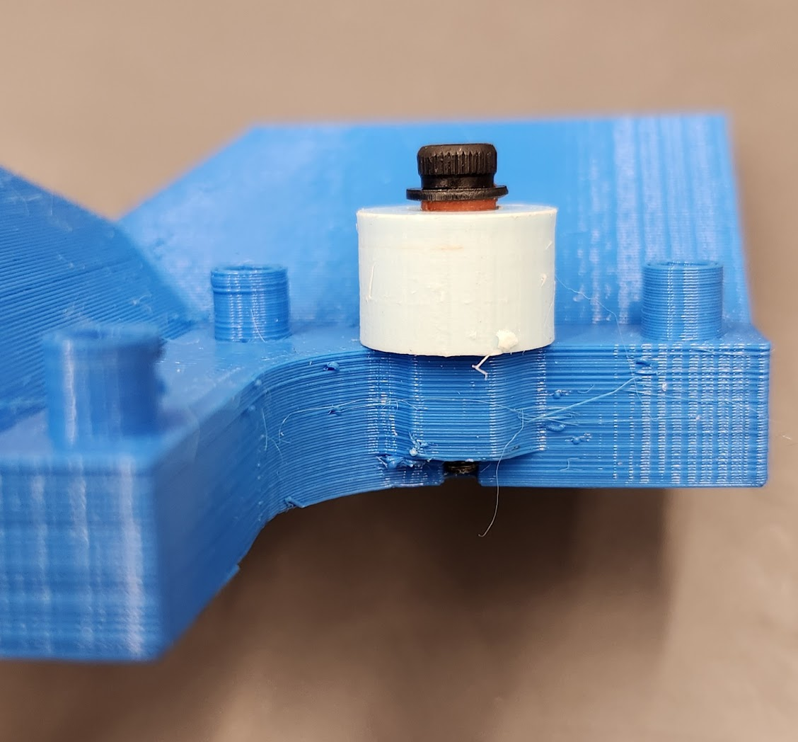

# Hardware Requirements

## Items Needed

| Quantity | Name / Link                                                               |
| -------- | ------------------------------------------------------------------------- |
| 1        | [Arduino Board](https://www.amazon.com/dp/B01EWOE0UU) with USB-B cable    |
| 2        | [Stepper Motor Driver](https://www.amazon.com/dp/B075R88FMN)              |
| 1        | [SG90 Micro Servo](https://www.amazon.com/dp/B07MLR1498)                  |
| 2        | [NEMA 17 Stepper Motors](https://www.amazon.com/dp/B0B38GHRH8)            |
| 1        | [approx. 12V/1.5A DC Power Supply](https://www.amazon.com/dp/B0D2KNBHKG)  |
| 2        | [5mm Bore GT2 Pulley for 10mm Belt](https://www.amazon.com/dp/B09X18H75P) |
| 1        | [10mm 2GT Belt](https://www.amazon.com/dp/B0BYVC7K7J)                     |

> Note that only 2 pulleys are needed, but the link is for a pack of 5, so you only need to buy one pack.

There are also some misc. requirements which will depend on the specifics of your build. These include:

- Whiteboard, wall, etc. to plot on
- Whiteboard Marker, Sharpie, etc. to draw with
- Various Arduino Jumper Wires
- Some M3/M4 screws, washers, and nuts. [This kit](https://www.amazon.com/dp/B0CS67BLQJ) has all of the items needed:
  - 6 M3\*20 screws for attaching stepper motors to brackets
  - 2 M3\*16 screws and
  - 2 M3 washers for installing the bracket sleeve and spinner
  - 8 M4 screws for attaching brackets to whiteboard
  - 1 M4 screw and
  - 1 M4 nut for attaching/clamping the drawing implement to the pen holder
- 2 D-cell batteries for the weight holder. You may modify the weight holder for whatever weight you have (e.g., loose screws, nuts, etc.).
- A computer that can connect to the Arduino board. Consider a Raspberry Pi or an old laptop. It will need to stay connected for the duration of the drawing.

Finally, all prints in the [prints](/prints/) directory are required to build the robot.

| Name              | Notes                                |
| ----------------- | ------------------------------------ |
| VP_Bracket        | Print with supports                  |
| VP_Pen_Holder     | _None_                               |
| VP_Sleeve_Spinner | Print with high infill and precision |
| VP_WeightHolder   | _None_                               |

# Hardware Setup

## Section 1: Wiring

The wiring setup is relatively simple. The following diagram shows how to connect the stepper motors, servo, and power supply to the Arduino board.
Wiring Diagram:

Example:

## Section 2: Whiteboard

### Pen Holder Assembly

1. Install the SG90 Servo into the VP_Pen_Holder as shown below.

   
1. Insert the midpoint of the belt into the VP_Pen_Holder
1. Place an M4 nut inside of the VP_Pen_Holder on the side closer to the servo.
1. Screw the M4 screw above the belt, through the VP_Pen_Holder, into the nut.

   
1. Place two D-cell batteries into the VP_WeightHolder.
1. Screw an M4 screw through the VP_Pen_Holder and the VP_WeightHolder. The two should be firmly attached with no pivoting about the screw. Ensure the VP_WeightHolder is pressed flush against the VP_Pen_Holder.

   

### Bracket Assembly

These steps will be repeated for both the left and right brackets. The pictures shown are for the right bracket, but the left bracket is a mirror image.

1. Screw an M3\*16 screw into one of the VP_Sleeve_Spinner print's smaller tubes (the "sleeve"). Place an M3 washer on the screw before screwing it in.
1. Insert the sleeve/washer/screw assembly into the larger VP_Sleeve_Spinner tube (the "spinner"). In this guide, for visibility,

- the sleeve is orange,
- the spinner is light blue, and
- the bracket is dark blue.

  

1. Screw the sleeve assembly (with the spinner around it) into the bracket as shown below.

   > The spinner should be loose and freely spin. It is ok if it wiggles when shaken.

   

1. Attach a pulleys to the stepper motor, ensuring the flat edge of the stepper motor shaft has a set screw pressing against it, as shown in the below example. Firmly tighten the set screws.

   
1. Attach the stepper motor to the VP_Bracket using M3\*20 screws. It is recommended to attach the stepper motor such that the wires are on one of the sides that will be facing away from the whiteboard. In the below image, those are the sides facing away from the camera.

   
1. By hand, rotate the belt into the pulley. Depower the steppers to facilitate this.
1. Attach the VP_Bracket to the whiteboard using M4 screws. On each bracket, the sleeve/spinner side should be the highest when installed (this is how to differentiate the left vs. right bracket).
   > It is recommended to drill holes in the whiteboard before screwing in the screws. You can use the bracket as a location template. Pre-drilling will help prevent the whiteboard from cracking.

This is what the top right corner of the whiteboard should look like when everything is installed (stepper wires not shown):

> Note the location of the spinner assembly, which is pointed at with a red arrow; it should be on the TOP of the belt, not to the side.
