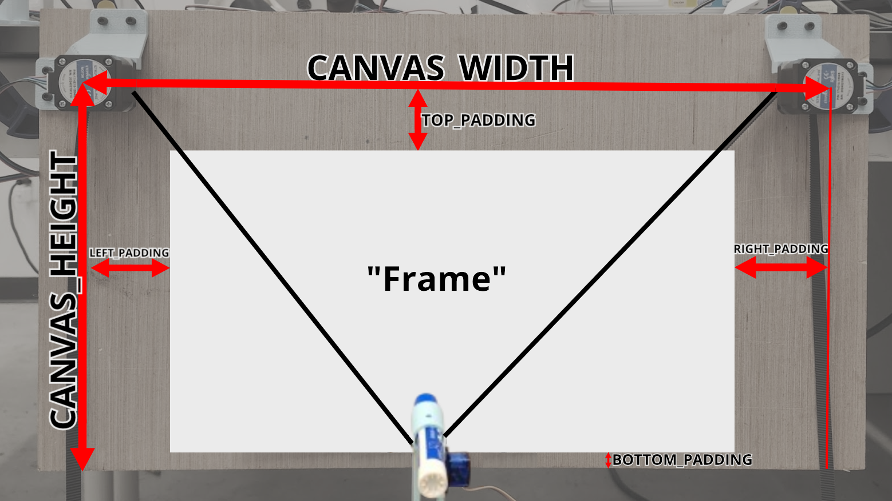

# Software Setup

This guide will walk you through the initial setup of the software, including dependencies and configuration.

## Install Dependencies

### PlatformIO

This project uses PlatformIO to manage dependencies and compile the code for the arduino. To install PlatformIO, follow the instructions on the [PlatformIO website](https://platformio.org/install/cli). You only need to upload the code to the Arduino once, so you can uninstall PlatformIO after the initial setup if you wish.

The PlatformIO project is located in the [arduino](/arduino/) directory. To upload the code to the Arduino,

1. Connect the Arduino to your computer via USB.
1. Install the PlatformIO extension in VSCode.
1. Open VSCode in the [arduino](/arduino/) directory.
1. Press `Ctrl+Alt+U` to upload the code to the Arduino.

Take note of the output from the upload process. If uploaded successfully, there should be a section that looks like this:

```
Looking for upload port...
Auto-detected: COM13
```

The port (COM13) will be used later.

### Python Setup

This project was tested with and works with Python 3.11.9. Other versions _should_ work but are untested.

Install all dependencies by running the following command in the root directory of the project:

```bash
pip install -r requirements.txt
```

## Set User Constants

The software has two constants files. The first is [constants.py](/constants.py), which contains the predefined constants for the software. The second is [user_setup.py](/user_setup.py), which you will need to set up.

`INPUT_IMG_FILE_PATH` - You will change this every time you want to draw a new image. This is the path to the SVG file you want to draw. The SVG file should be in the `user/SVGs/` directory, but this is not necessary.

`START_FROM_POINT` - This variable will be used if you want to draw a subset of an SVG. If, for some reason, the previous drawing was interrupted, you can set this variable to the point you want to start from. The default value is 0, which means the drawing will start from the beginning of the SVG. To see the point the last drawing was interrupted at, check the progress.txt file.

`MAX_CM_BETWEEN_POINTS` - used when interpolating points. Higher values will result in fewer points and faster drawing, but the drawing will be less accurate. Lower values will result in more points and slower drawing, but the drawing will be more accurate. The recommended value range is (0, 2]

`ARDUINO_USB_PORT` - The port that the Arduino is connected to. This is the port that was outputted when the code was uploaded to the Arduino. On Windows, it will look something like `COM13`. On Linux, it will look something like `/dev/ttyACM0`. If you want to find this port without uploading the arduino again, you can run the [lisb_usb_ports.py](/list_usb_ports.py) file. The port connected to the arduino will likely have "Serial" or "Arduino" in its name.

`SHOW_PREVIEW` - Whether or not to show a preview on the screen before drawing the SVG. Useful for confirming that the SVG is being placed and scaled correctly.

`TURTLE_PENSIZE` - the width of the pen in pixels. Only affects preview, not actual drawing.

`BACKGROUND_IMG_FILE_PATH` - The path to the image file that will be used as the background. This is optional. If you don't want a background image, set this to `None`.

More about the below values can be found in the [Canvas Explained](#canvas-explained) section.
`CANVAS_WIDTH` - The width in cm of the canvas.  
`CANVAS_HEIGHT` - The height in cm of the canvas.
`TOP_PADDING` - The distance in cm between the top of the canvas and the drawable area.
`LEFT_PADDING` - The distance in cm between the left side of the canvas and the drawable area.
`RIGHT_PADDING` - The distance in cm between the right side of the canvas and the drawable area.
`BOTTOM_PADDING` - The distance in cm between the bottom of the canvas and the drawable area.

### Canvas Explained

The "canvas" is a rectangular area defined by the distance between the stepper motor shafts and the distance from the stepper motor's shaft to the bottom of the board. The "frame" is the user-defined area within the canvas where the user permits the pen to draw.

The following term

| Term           | Definition                                                                           |
| -------------- | ------------------------------------------------------------------------------------ |
| Canvas Width   | The distance in cm between the center of each stepper                                |
| Canvas Height  | The distance in cm between the center of the stepper and the bottom of the board     |
| Frame          | The drawable rectangular subarea of the canvas. Defined by the padding               |
| Left Padding   | The user-defined distance between the left side of the canvas and the drtawable area |
| Right Padding  | The user-defined distance between the right side of the canvas and the drawable area |
| Top Padding    | The user-defined distance between the top of the canvas and the drawable area        |
| Bottom Padding | The user-defined distance between the bottom of the canvas and the drawable area     |

The below image illustrates these terms. In this image, the white rectangle represents the frame, which is the only area where the pen is allowed to draw.

